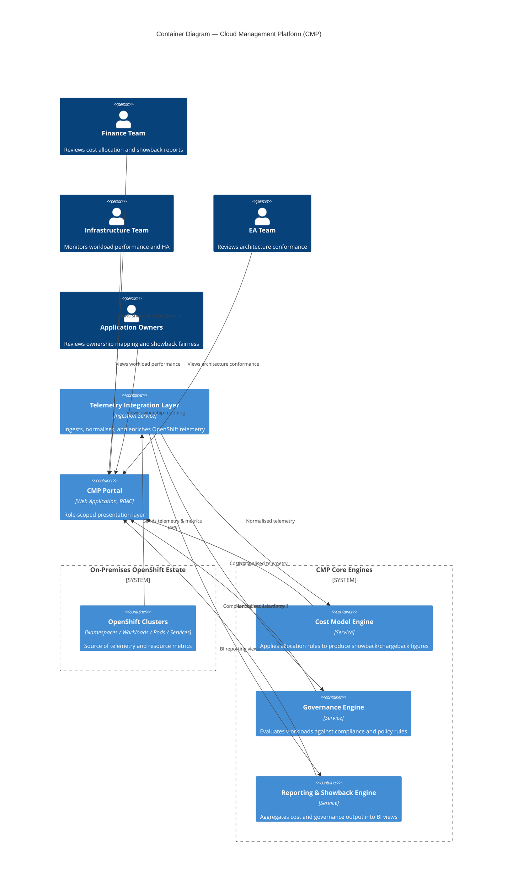

# CMP Architecture Document (TOGAF ADM)

> **Portfolio Project** · OrikiTech Consultancy × Aztec Bank Nigeria · 2025–2026
> Prepared by: Chukwuemeka Nwoke, Product Owner, OrikiTech Consultancy
> Sponsor: Group CIO, Aztec Bank Nigeria

---

## 1. Purpose

This document describes the target architecture for the Cloud Management Platform (CMP), developed to give Aztec Bank Nigeria end-to-end cost transparency, governance accountability, and performance visibility across its on-premises OpenShift estate. It follows the structure of TOGAF's Architecture Development Method (ADM), scoped to the phases relevant to a platform (rather than enterprise-wide) engagement: Architecture Vision, Business Architecture, Information Systems Architecture, Technology Architecture, and Opportunities & Solutions.

---

## 2. Architecture Vision (Phase A)

**Problem statement.** Aztec Bank Nigeria's infrastructure and finance teams had no shared, governed view of OpenShift workload cost, ownership, or compliance posture. Cost allocation was manual and reactive; there was no showback or chargeback mechanism; and governance controls were not consistently enforced across namespaces.

**Vision statement.**
> *"Enable teams to see, understand, and optimise their workloads — improving cost transparency, operational efficiency, and governance adherence — through a governed, insight-led Cloud Management Platform."*

**Architecture principles applied:**
- **Insight before enforcement** — showback precedes chargeback; visibility precedes control.
- **Phased value delivery** — each phase must deliver measurable value before the next is unlocked.
- **Governance by design** — RBAC and audit are day-one requirements, not retrofits.
- **On-premises first** — Phase 1–2 scope is strictly on-premises OpenShift; hybrid/multi-cloud is explicitly deferred.

---

## 3. Business Architecture (Phase B)

**Stakeholders and their concerns:**

| Stakeholder | Concern |
|---|---|
| Group CIO (Architecture Sponsor) | Governance adherence, platform ROI, cross-bank scalability |
| Finance Team | Accurate cost allocation, chargeback readiness |
| Infrastructure Team | Operational efficiency, workload performance, HA |
| EA Team | Architecture conformance, integration integrity |
| Application Owners | Ownership mapping accuracy, showback fairness |

**Value stream:** Telemetry capture → cost modelling → governed reporting → informed workload decisions → (Phase 2) enforced chargeback and automated remediation.

**Business capabilities delivered:**
- Cost attribution and modelling across namespaces/workloads
- Governance and compliance workflow enforcement
- Showback reporting (Phase 1) and chargeback settlement (future roadmap)
- Role-scoped reporting for Finance, Infrastructure, EA, and Application views

---

## 4. Information Systems Architecture (Phase C)

### 4.1 Data Architecture
- **Source of truth:** OpenShift cluster telemetry (namespaces, workloads, pods, services) and resource metrics.
- **Ownership data:** Application-to-business-unit mapping, collected and validated manually in Phase 1, targeted for dynamic mapping in Phase 2.
- **Cost data:** Derived via the Cost Model Engine from telemetry + allocation configuration.

### 4.2 Application Architecture

*Diagramming approach documented in [ADR-001](architecture-decisions.md#adr-001-use-mermaid-c4-diagrams-for-architecture-documentation).*

**Component responsibilities:**

| Component | Responsibility |
|---|---|
| Telemetry Integration Layer | Ingests raw OpenShift metrics, normalises across cluster/namespace schemas, enriches with ownership metadata |
| Cost Model Engine | Applies allocation rules to telemetry to produce showback/chargeback figures |
| Governance Engine | Evaluates workloads against compliance and policy rules; feeds audit trail |
| Reporting & Showback Engine | Aggregates cost + governance output into BI reporting views |
| CMP Portal | RBAC-scoped presentation layer for Finance, Infrastructure, EA, and Application stakeholders |

---

## 5. Technology Architecture (Phase D)

| Layer | Technology |
|---|---|
| Compute Platform | On-premises OpenShift Clusters |
| CI/CD | Existing enterprise CI/CD pipeline |
| Portal | Web application with RBAC |
| Monitoring | OpenShift monitoring stack + custom ingestors |
| Security | RBAC + TLS in transit |
| Audit | Centralised audit trail with log retention policy |
| Reporting | BI Reporting engine (Chargeback + Showback) |
| Automation | IT Automation Process Backend + Workflow Engine |

**Non-functional requirements:**
- **Availability:** Phase 2 introduces High Availability infrastructure for the CMP platform itself (see [phase-two-plan.md](phase-two-plan.md)).
- **Security:** All telemetry and reporting traffic encrypted in transit; access governed by RBAC scoped to stakeholder group.
- **Auditability:** All cost and governance decisions logged to a centralised, retained audit trail — a regulatory requirement for a banking environment.

---

## 6. Opportunities & Solutions (Phase E)

Delivery was split into two work packages to de-risk adoption and validate the cost model before committing to full production rollout:

- **Phase 1 — Chargeback: Insight.** Establish telemetry ingestion, cost modelling, ownership mapping, and showback reporting for selected critical workloads. See [phase-one-plan.md](phase-one-plan.md).
- **Phase 2 — Control & High Availability.** Migrate to HA infrastructure, extend OpenShift integration, introduce dynamic service mapping, and implement automation workflows at scale. See [phase-two-plan.md](phase-two-plan.md).

Deferred to the future roadmap (out of current scope): hybrid/multi-cloud support, full chargeback settlement, AI-driven optimisation (AAEPM), and cross-bank platform rollout.

---

## 7. Architecture Governance

Architecture conformance was reviewed at each phase gate by the EA Team and signed off by the Group CIO before the next phase was unlocked. Key governance decisions are recorded in [README.md](../README.md#-key-product-decisions--learnings), under **Key Product Decisions & Learnings** — including the pilot-first deployment strategy, the showback-before-chargeback sequencing, and the day-one RBAC requirement.

---

*This document is part of a portfolio representation of a real-world architecture engagement. Client and partner names have been anonymised.*
